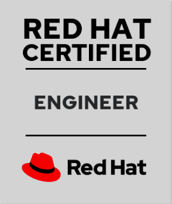

<h1> RANVEER SINGH</h1> 	
Address: Alwar, Rajasthan, India  
E-mail: srnvry@gmail.com  
Contact:  +91-9799572100  

**EXPERIENCE**
---
**Keen and Able  Pvt Ltd**  
**Role: DevOps Engineer** *- May 2021 to present*

**PROFESSIONAL CERTIFICATIONS** 
---
Certification Number: 180-065-252
- ***[Red Hat Certified System  Administrator in Red Hat OpenStack](https://rhtapps.redhat.com/certifications/badge/verify/VRYPYLUYBGU7MCRBGDVBJFT6NUAEQU3CUPSQX2KSDXT6RW46LQ3YBRY5HRN67XMD6X5VFP7ULSUKWW2HMIDYOMU6FAH2SEJXEIJCF5Y=)***
- ***[Red Hat Certified Engineer](https://rhtapps.redhat.com/certifications/badge/verify/VRYPYLUYBGU7MCRBGDVBJFT6NUAEQU3CUPSQX2KSDXT6RW46LQ3XCZJWRJNV7ILTXVE4I6VB7OTCG4U5NQYTCNA62RUWOCM34WWBUYQ=)***
- ***[Red Hat Certified System Administrator](https://rhtapps.redhat.com/certifications/badge/verify/VRYPYLUYBGU7MCRBGDVBJFT6NUAEQU3CUPSQX2KSDXT6RW46LQ3T7ULZ55KZZ56SKO7EQ3ETTLYZQ4U5NQYTCNA62RUWOCM34WWBUYQ=)***

**PROJECTS**
---
**Deployment of RedHat Openstack HCI with Baremetal Openshift, Red Hat Virtualization, RedHat IDM, Ansible Tower and Satellite** Time- Oct/2021 to Feb/2022
- Worked  on personal cloud infrastructure Design and  Deployment,  We have 3 sites  2 have production and one have staging environment, both production sites located in two geological locations and It’s  for a telco client.
Worked on deployment RedHat Openstack v16.2 HCI model (RedHat Openstack v16.2 and Redhat ceph storage v4) and RedHat Openshift on top of RedHat Openstack  and 5 node openshift on bare metal and 5 node openshift on Red Hat Virtualization for infrastructure monitoring. Both sites have separate  Red Hat Virtualization for management zones. On Red Hat Virtualization we have deployed openshift, ansible tower, IDM, and Satellite server .
- **RedHat Openstack v16.2 HCI Model -** Worked on deployment RedHat Openstack  16.2 with RedHat Ceph storage, we have 140 node with there different different capabilities on both site, 3 node stand for controller where RedHat Openstack  and ceph service running and 5 type of compute node (Com, HCI, Lake, Bss, Win). HCI nodes have extra 18 storage disk for ceph OSD and 2 nvme disk for ceph journaling, Lake node have 11 disk which is configured in Raid5  it is encrypted and it is available for nova instances. Cinder storage have multiple backend like ceph storage, FC Netapp and local encrypted storage  
- **RedHat Ceph storage -** Worked on deployment ceph storage with 25 OSD servers. ceph storage is the backend of cinder, manila, swift  and it also shares storage through nfs to the end user.
- **Openshift -**  Worked on deployment RedHat Openshift on Red Hat Virtualization, bare metal and RedHat Openstack.  I help in RedHat Openshift deployment On RedHat Openstack  and bare metal  we deployed it for customer application and On Red Hat Virtualization we deployed it for RedHat Openstack  monitoring.
- **Red Hat Virtualization -**  Worked on deployment Red Hat Virtualization on 4 servers for management zones on both sites. Hare Red Hat Virtualizationanager is running on a physical server. On Red Hat Virtualization we have deploy director server for deploying and managing  overcloud, RedHat IDM for managing user authentication, Satellite server and Ansible Tower for automate the Task 
- **RedHat IDM -** Worked on deployment 4 node IDM  and they replicated to each other. Both sites have 2 IDM servers. RedHat Openstack UI, Red Hat Virtualization Physical servers, ansible tower UI Satellite UI and  Red Hat Virtualization UI user are authenticated with IDM, On IDM we have configured sudo user sudo command, user and group 
- **Ansible Tower -**  ansible tower is used for task automation, On both sites we have  deployed 3 node ansible tower with separate DB nodes, Both sites DB are replicated to each other  using  active passive method.
- **RedHat Satellite -** Worked on  Satellite Deployment in both site and prepare it for end user and RedHat Openstack , Red Hat Virtualization, Ansible Tower, IDM and Satellite deployment 

**Deployment of Openstack with Openshift and satellite** Time- May/2021 

- Worked on  RedHat Openstack v16 Deployment using tripleo with InstanceHA and local registry (Disconnected)
- Help in Openshift Deployment over the Openstack 
- Help in RedHat Openshift Deployment over the kvm for infrastructure monitoring.
- Worked on Red Hat Openstack Platform upgrade from RedHat Openstack 16 to RedHat Openstack  16.2 using satellite 
- Day to Day Operation work on RedHat Openstack
- Worked on Satellite deployment 
- Prepare satellite for RedHat Openstack  v16.2 

**Deployment of Red Hat Virtualization Self-Hosted** Time- Aug/2021
- Worked on Red Hat Virtualization Self-hosted engine  Deployment 
- Day to day  operation work on Red Hat Virtualization

**Provide  Support on openstack and ceph storage** Time- Sept/2021
- Worked on Providing  support on Openstack and RedHat ceph storage in day to day work and also on troubleshooting and implementing the solution  

**PROJECTS CLIENTS**
---
- Oman Data Park Oman 
- NIC New Delhi India 
- ICTA Sri Lanka 

**Key Skills Used**
---
- **Cloud Computing** –  Openstack (Redhat Director, Kolla-ansible , Triple-O, Packstack)  Openshift
- **Storage** – Ceph Storage(Redhat’s & Opensource), NFS, SAN, Jboard etc.
- **Automation** – Ansible , Terreform, Shell Scripting and Python Scripting.
- **Networking**  – Switch, router, bridge, tunnel, vlan, vxlan
- **Cloud Management tools** – Red Hat Cloudforms
- **CI and other  tools** – Jenkins, GIT, Nexus, Gitea, GitLab,  Docker, Podman etc.
- **Monitoring tools**  – Node-exporter, Prometheus, Grafana etc.

**COLLEGE PROJECTS**
---
- Deployment of HCI based Multinode Openstack using Kolla-ansible. 
- Configured Centralized logging server using rsyslog.
- Deployment of Openstack which have multiple cinder backed like LVMs and Ceph.  Also checked cinder Volumes/data into the ceph cluster. 

**INTERNSHIP**
---
**Linux World, Jaipur**  
*Role: Trainee (RedHat Openstack - CL210)*  
- Gained depth knowledge of Red Hat Linux, OpenStack deployment using Packstack, Devstack, kola-Ansible , Basics of Openstack services, Openstack Cloud  Administration, Managing Stack, Basics of Undercloud-Overcloud and RedHat Openstack   deployment  

**FOSTERing Linux, Gurugram**  
*Role: Trainee (RHCSA, RHCE)*  
- Gained depth knowledge of Red Hat Linux, Installation with Kickstart, Networking,  User Management, Permissions, Partitions, LVM, KVM, Servers and Security (FTP,  SSH, DNS, NFS, LDAP, Samba, ISCSI, MariaDB, Apache Web server etc.) 

**Skills Learned During Internship** 
---
- ***Programming Languages & database** – Python Scripting, Shell Scripting and mysql*
- ***Operating Systems** – RHEL7/8, CentOS7/8, Kali Linux, Backtrack, Ubuntu, Windows, Fedora etc.*
- ***Software** – Red Hat Virtualization, Ansible, Terraform, GIT,  Jenkins etc.*
- **AWS** – S3, EC2
- ***Security** – IPA Server, Secure Centralized Logging Server, Iptables, Security Updates, ACL, LUKS, PAM, Verify Packages.*
- ***Cloud Computing** – AWS, Openstack, Containers, Docker, etc.*

**EDUCATION**
---
- **Bachelor of Computer Application  - 2020-2023 batch (Distance)** 
    Jaipur National University Jaipur
- **Senior Secondary School (BSER) - 2013** 
    Board of secondary education Rajasthan
